# Задание 1

1. Итоговая система будет состоять из следующих доменов:
- **Media Area** - непосредственно видео-контент, сервисы воспроизведения и трансляции, интеграции с сервисами дополнительной информации о контенте, магазины и маркетплейсы, платежные системы.
- **Control Center** - сервисы авторизации, упраления доступом, внешними коммуникациями, маршрутизацией запросов, логирование действий и событий, балансировка потокв данных.
- **User Managment** - представление пользователя системы, подписки, персональные рейтинги, скидки, управление предпочтениями, личные рекомендации.
- **System Support** - системаная и технологическая поддержка: базы данных, системы очередей, сервисы построения UI, систем поддержки аппаратуры пользователя.

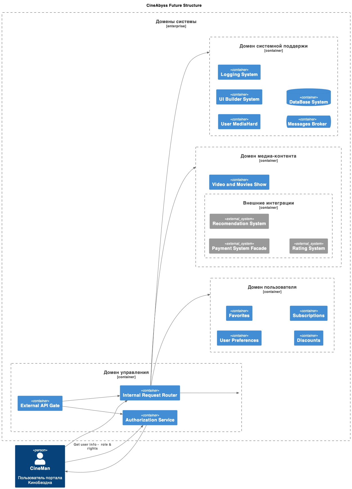
[Контейнеры (С4 PlantUML)](diagrams/containers.puml)

# Задание 2

### 1. Proxy
Команда КиноБездны уже выделила сервис метаданных о фильмах movies и вам необходимо реализовать бесшовный переход с применением паттерна Strangler Fig в части реализации прокси-сервиса (API Gateway), с помощью которого можно постепенно переключать траффик, используя фиче-флаг.

Cервис "Proxy" реализован на языке Python, с использованием библиотек **Flask** и **requests**. Размещен в каталоге ./src/microservices/proxy. Конфигурация запуска добавлена в файл проекта docker-compose.yml.

### 2. Kafka
Для проверки простоты включения в контур новой системы брокера сообщений Kafka, релизован простой микросервис генерации  сообщений - "events". Cервис реализован на языке Python, с использованием библиотеки **Flask**. Размещен в каталоге ./src/microservices/events. Конфигурация запуска добавлена в файл проекта docker-compose.yml.

В качестве тестового получателя сообщений, реализован микросервис "сlient". Сервис размещен в каталоге /src/microservices/сlient, реализован на языке Python, с использованием библиотеки **Flask**. Конфигурация запуска добавлена в файл проекта docker-compose.yml.

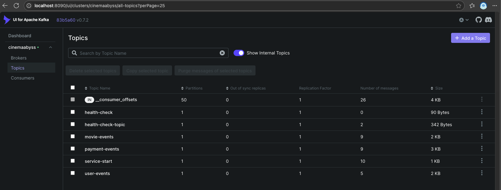
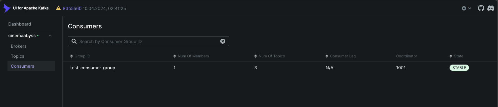
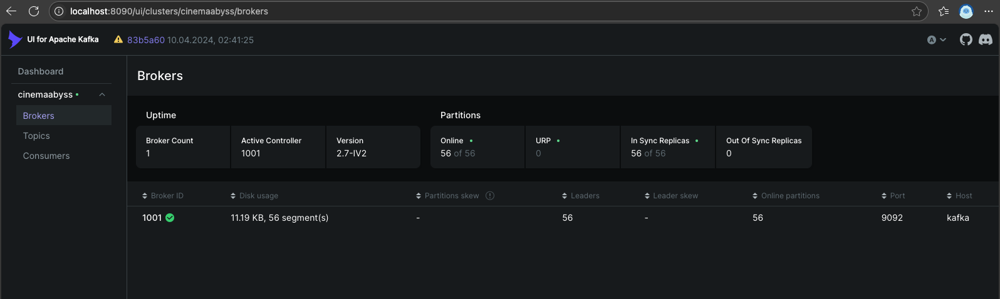

** Тесты **

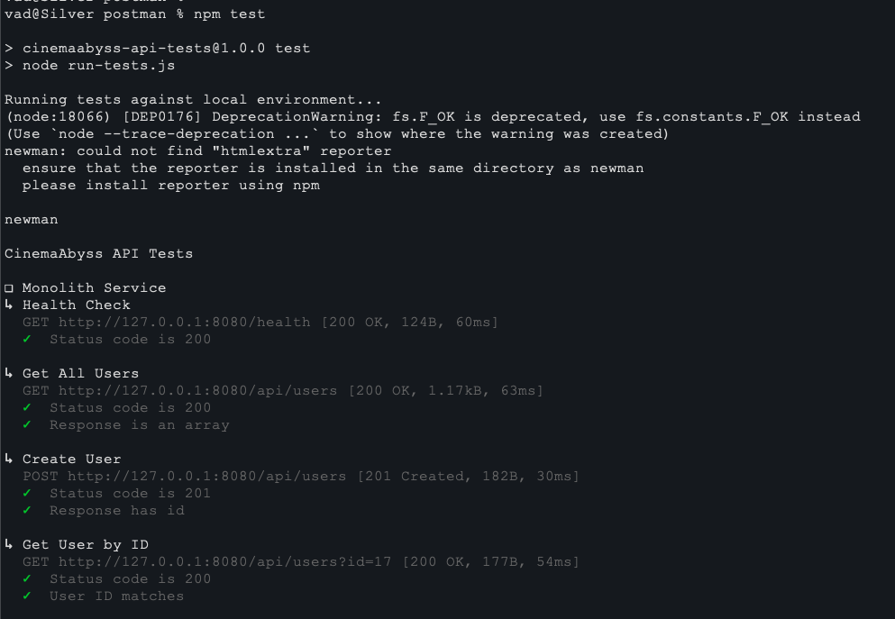
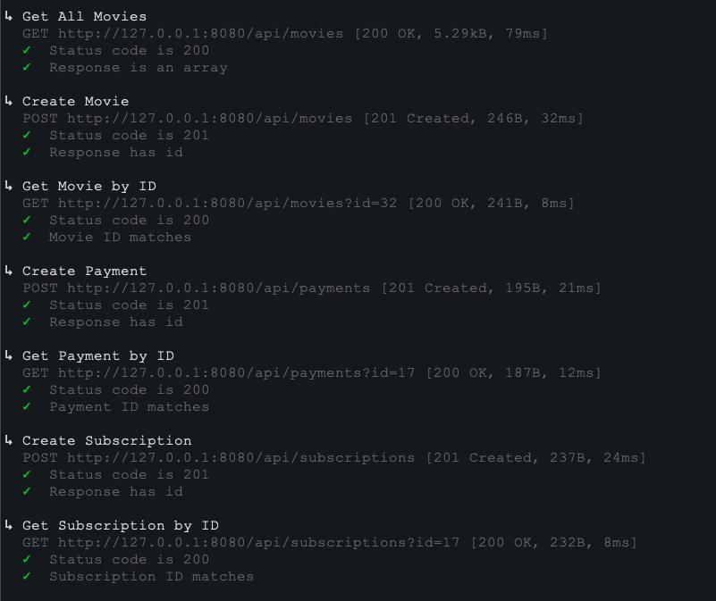
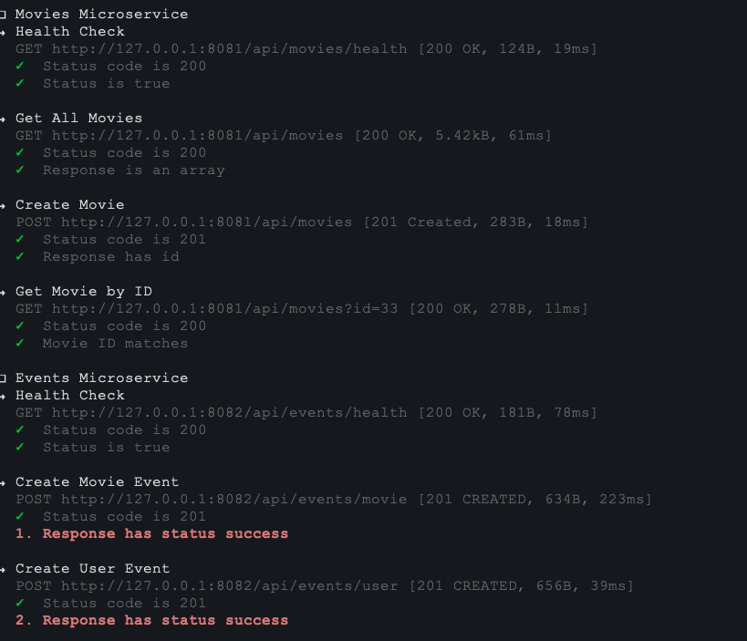
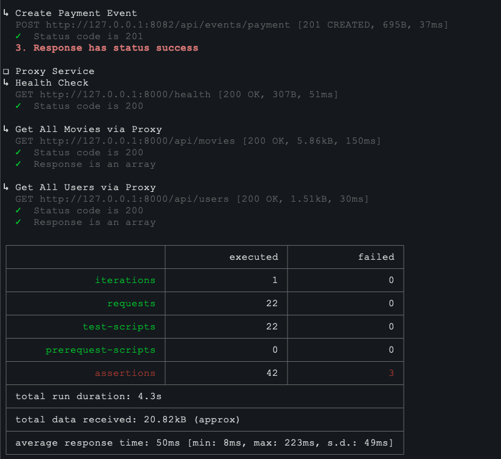

# Задание 3

Выполнено разворачивание приложения в кластере Kubernetes

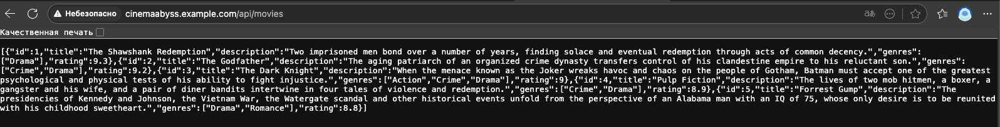

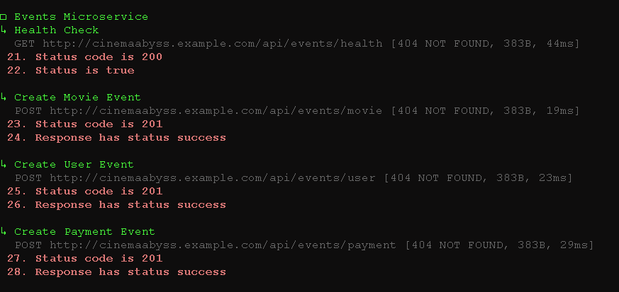
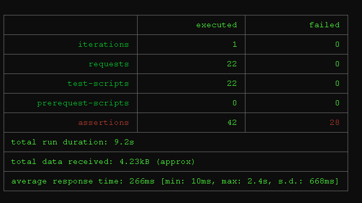

В силу имеющихся ограничений программно-аппаратных средств, а так же качества доступа к сети Интернет, добиться полного успешного выполнения тестов не удалось. Имели место успешные прогоны без внесения каких-бы то ни было изменений в код и настройки. Прошу это учесть.

# Задание 4

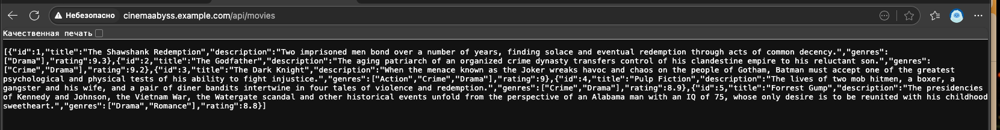